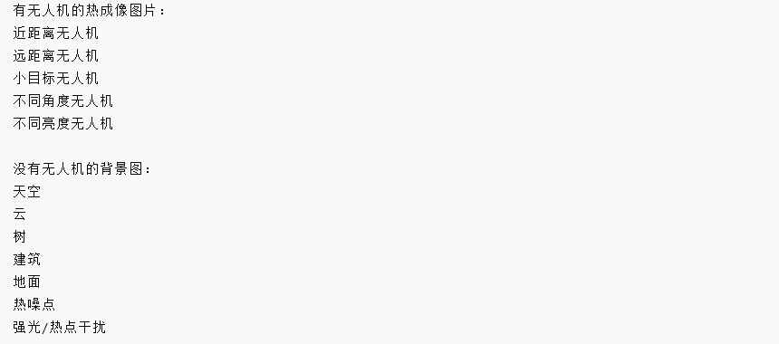

#   RK3588的Yolo + ByteTrack

## 1.   图片注释及说明:
- ***跳帧+卡尔曼预测***：// @link@:images/跳帧+卡尔曼预测.png

- PF16量化成INT8


## 2.   ONXX导出RKNN的python脚本：
```py
from rknn.api import RKNN

# Windows 路径：E:\课程学习\鲁班猫笔记\rknn模型\fz00.onnx
# WSL 路径：/mnt/e/课程学习/鲁班猫笔记/rknn模型/fz00.onnx
ONNX_MODEL = "/mnt/e/课程学习/鲁班猫笔记/rknn模型/fz00.onnx"

# 转换完成后，RKNN 会生成到 Windows：E:\课程学习\鲁班猫笔记\rknn模型\fz00.rknn
RKNN_MODEL = "/mnt/e/课程学习/鲁班猫笔记/rknn模型/fz00.rknn"

rknn = RKNN(verbose=True)

print("--> Config RKNN")
ret = rknn.config(
    target_platform="rk3588",
    mean_values=[[0, 0, 0]],
    std_values=[[255, 255, 255]]
)
if ret != 0:
    print("Config RKNN failed")
    exit(ret)

print("--> Load ONNX model")
ret = rknn.load_onnx(model=ONNX_MODEL)
if ret != 0:
    print("Load ONNX failed")
    exit(ret)

print("--> Build RKNN model")
ret = rknn.build(do_quantization=False)
if ret != 0:
    print("Build RKNN failed")
    exit(ret)

print("--> Export RKNN model")
ret = rknn.export_rknn(RKNN_MODEL)
if ret != 0:
    print("Export RKNN failed")
    exit(ret)

print("RKNN model saved to:", RKNN_MODEL)

rknn.release()
```

## 3.   CPU/GPU/NPU的各自任务
- NPU：YOLO 检测推理
- CPU：预处理、后处理、Kalman / ByteTrack、控制逻辑
- GPU：显示、窗口渲染、可能的图像显示加速

## 4.   模型尺寸
- **ONNX inputs:**  images [1, 3, 512, 640]


